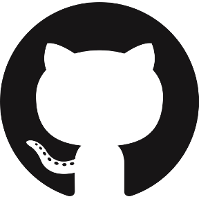

<!-- Social icons section -->
<h1 align="center"> Social Media: </h1>
  

    
    
    
    
  

</h1>

<!-- Description about me -->
<h2 align="center"> 🤔 About me 👨‍💻 </h2>

Hi!!!  
I am <b>Menusha Eshan Katipearachchi</b> better known as 'Menusha'🕵🏼‍♂️  
I am from <strong>Colombo, Sri Lanka</strong>☕☕  
I'm a guy who loves to develop new things 🖥️  
So... I am more than a robot coding 🤖, I am a real human trying to learn new things and develop incredible projects with ❤️ meeting incredible people on the way🚀 
If you are interested in a guy with a good vibe who loves the knowledge and the constant learning 📚, <b>⚙️I AM YOUR GUY⚙️</b>  
Contact me for new projects 📨, I am open to collaborate with you
   

<!-- Sri Lanka's weather table -->

<h2 align="center"> Sri Lanka's Weather ⛅ </h2>
<table align="center" style="width:50%">
    <tr style="text-align:center">
        <th>Weather</th>
        <th>Temperature</th>
        <th>Sunrise</th>
        <th>Sunset</th>
        <th>Humidity</th>
    </tr>
    <tr style="text-align:center">
        <td><b>cloudy</b></td>
        <td><b>26°C</b></td>
        <td><b>06:11 AM</b></td>
        <td><b>05:55 PM</b></td>
        <td><b>77%</b></td>
    </tr>
</table>

### 🧐 More About Me:
<table style="border: none;">
  <tr style="border: none;">
    <td style="border: none;">
      <ul>
        <li>
          🔭 I’m currently studying at **SLIIT**
        </li>
        <li>
          🤝 I’m looking to collaborate on Open Source Projects
        </li>
        <li>
          🌱 I’m currently learning Image Procesing and Understating & Machine Learning; 
        </li>
        <li>
          👨🏻‍💻 Most of my projects are available on [Github](https://github.com/MenushaKatipearachchi?tab=repositories)
        </li>
        <li>
          💬 Ask me about anything tech related, I am happy to help (if you have questions with Windows you can ask me🪟);
        </li>
        <li>
          📫 Feel free to contact me on [LinkedIn](https://www.linkedin.com/in/menusha-katipearachchi-bb057b205/)
        </li>
        <li>
          🎸 When I am free, I like to play the guitar
        </li>
    </td>
  </tr>
</table>
   

<!-- languajes and skills section -->

<h1 align="center"> Languages/Frameworks I'm good at: </h1>

  <code></code>
  <code></code>
  <code></code>
  <code></code>
  <code></code>
  <code></code>
  <code></code>
  <code></code>
  <code></code>
  <code></code>
  <code></code>

 

<h1 align="center"> Languages/Frameworks I'm learning: </h1>

  <code></code>
  <code></code>
  <code></code>
  <code></code>
  <code></code>
  <code></code>

 

<h1 align="center"> Environments I work with: </h1>

  <code></code>
  <code></code>
  <code></code>
  <code></code>

 

<!-- GitHub stats section -->

## 📊 Github stats

<!-- Bassed on: https://github.com/anuraghazra/github-readme-stats -->

   
  
  
   
  <b>Note:</b> Top languages is only a metric of the languages my public code consists of and doesn't reflect experience or skill level.

<!-- Projects section -->

## 📘 My top open source projects

<!-- Bassed on: Repo info cards - https://github.com/anuraghazra/github-readme-stats -->

  

    
    
  

  
&#8192;

  

    
  

&#8192;

&#8192;

  

<!-- last activity section -->

## Activity Graph

<!--    -->
  

 

<!-- last refresh of readme section -->

Last refresh: <b>Friday, December 8, 7:17 AM GMT-5</b>

<!---
MenushaKatipearachchi/MenushaKatipearachchi is a ✨ special ✨ repository because its `README.md` (this file) appears on your GitHub profile.
You can click the Preview link to take a look at your changes.
--->
